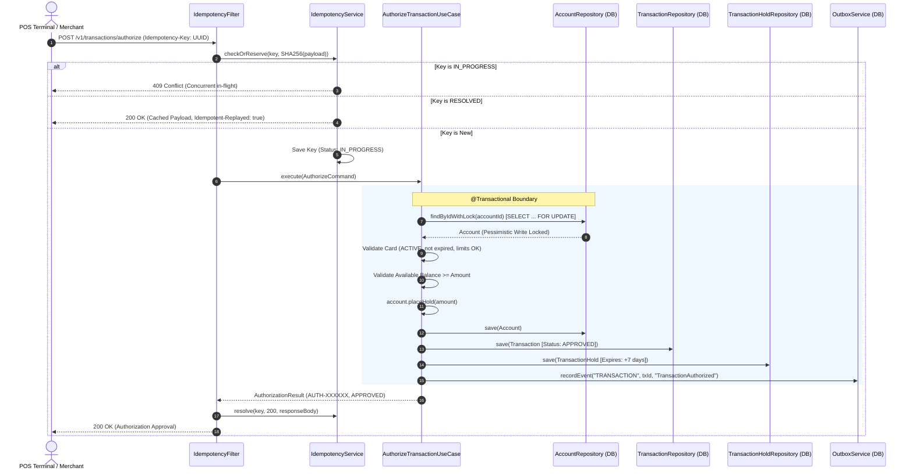
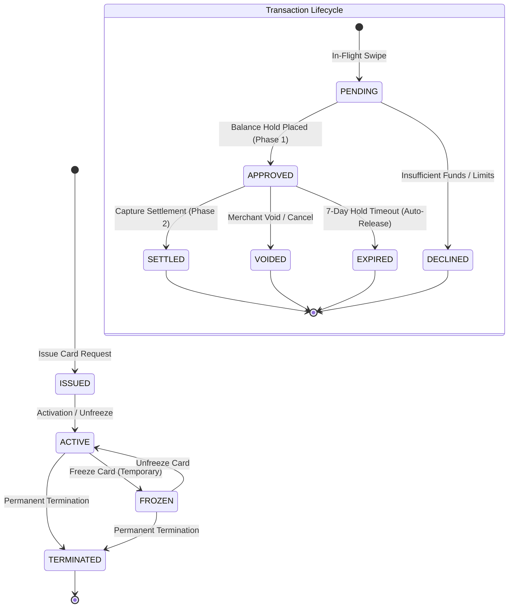

# 💳 Card Issuance & Real-Time Transaction Authorization Platform

[](https://openjdk.org/)
[](https://spring.io/projects/spring-boot)
[](https://www.postgresql.org/)
[](https://flywaydb.org/)
[](http://localhost:8081/swagger-ui.html)
[](#5-concurrency--stress-testing-benchmarks)
[](docs/ARCHITECTURE.md)

---

## 1. Executive Summary

> **Author & Platform Maintainer:** Aaditya Kumar Singh  
> **Platform Version:** v1.0.0 (Production Core Specification)

The **Card Issuance & Transaction Authorization Platform** is a production-grade, high-throughput FinTech core backend engine engineered to handle **card lifecycle management**, **sub-50ms real-time swipe authorizations**, **two-phase balance holds and settlement clearing**, **strictly balanced immutable double-entry ledger bookkeeping**, and **atomic transactional event dispatching**.

> 📘 **Looking for deep system mechanics and interview defense?**  
> Read the complete **[System Architecture & FinTech Defense Guide](docs/ARCHITECTURE.md)** covering pessimistic vs optimistic locking, dual-write elimination, outbox polling mechanics, and interview Q&A.

### Key Capabilities
- **Real-Time Two-Phase Authorization & Settlement Engine**: Authorizations place 7-day balance holds against spendable funds without altering settled ledger balances. Captures reconcile against merchant clearing accounts.
- **Pessimistic Concurrency Control**: Zero double-spending under concurrent swipes using database-level `SELECT ... FOR UPDATE` row locks.
- **Strict Multi-Legged Double-Entry Ledger**: Immutable accounting core enforcing $\sum \text{Debits} == \sum \text{Credits}$ with compensating reversal mechanics.
- **Atomic IETF HTTP Idempotency Layer**: Distributed request deduplication using SHA-256 fingerprinting, in-flight state-locking (`409 Conflict`), and cached response replaying (`Idempotent-Replayed: true`).
- **Guaranteed At-Least-Once Event Dispatching**: Transactional Outbox Pattern with exponential backoff with jitter and Dead Letter Queue (DLQ) containment.
- **Interactive OpenAPI 3 / Swagger Documentation**: Comprehensive interactive documentation with realistic masked PANs, 4-decimal currency amounts, and error envelopes.

---

## 2. High-Level Architecture & Domain Model

The codebase strictly follows **Hexagonal / Clean Architecture (Ports & Adapters)** principles. The domain model remains pure POJO/Java Records, completely isolated from framework annotations, databases, and network transports.

```
┌────────────────────────────────────────────────────────────────────────┐
│                               API Layer                                │
│        REST Controllers · Global Error Envelopes · OpenAPI 3.1         │
├────────────────────────────────────────────────────────────────────────┤
│                           Application Layer                            │
│           Use Cases · Orchestrators · Command / Query DTOs             │
├────────────────────────────────────────────────────────────────────────┤
│                              Domain Core                               │
│      Entities · Aggregates · Value Objects · Pure Business Rules       │
├────────────────────────────────────────────────────────────────────────┤
│                          Infrastructure Layer                          │
│   Spring Data JPA · PostgreSQL · Idempotency · Transactional Outbox    │
└────────────────────────────────────────────────────────────────────────┘
```

### Package Structure Map

```
com.cardplatform
├── api
│   ├── controller           # Card, Transaction, Ledger, System REST Controllers
│   ├── dto                  # Strict request/response DTO contracts with @Schema examples
│   └── exception            # Global @ControllerAdvice exception handler & error envelopes
├── application
│   ├── card                 # IssueCard, UpdateCardStatus, UpdateCardControls use cases
│   ├── ledger               # RecordJournalEntry, LedgerPostingService orchestrator
│   └── transaction          # AuthorizeTransaction, CaptureTransaction, VoidTransaction use cases
├── domain
│   ├── account              # Account entity, AccountStatus, AccountRepository port
│   ├── card                 # Card aggregate, CardControls, CardStatus, PAN masking
│   ├── ledger               # JournalEntry aggregate, LedgerPosting leg, PostingType, EntryType
│   └── transaction          # Transaction aggregate, TransactionHold, AuthorizationHold
├── infrastructure
│   ├── config               # OpenAPI 3 configuration, JPA Auditing, Jackson configuration
│   ├── idempotency          # IdempotencyFilter, IdempotencyService, SHA-256 fingerprinting
│   ├── outbox               # OutboxEventPublisher, OutboxService, DLQ retry scheduler
│   ├── persistence          # JPA Entities, Spring Data Repositories, Repository Adapters
│   └── security             # PAN masking utility, Key hashing utilities
└── common
    ├── audit                # TraceContext (Correlation ID, Idempotency tracking)
    ├── exception            # FinTech Domain Exceptions (InsufficientFunds, CardFrozen, etc.)
    └── money                # MonetaryAmount Value Object (BigDecimal precision 19, 4)
```

---

## 3. Architecture Diagrams

### A. Two-Phase Transaction Authorization Flow (Sequence Diagram)



---

### B. Card Lifecycle & Transaction State Machine



---

### C. Transactional Outbox Pattern & Resilient Dispatch Flow

```mermaid
flowchart LR
    subgraph SpringTransactionalContext ["Active @Transactional Boundary"]
        UC[Business Use Case] -->|1. Write Business State| DB[(PostgreSQL Database)]
        UC -->|2. Write Outbox Event| OE[outbox_events table]
    end

    subgraph AsyncWorker ["Asynchronous Poller Worker"]
        Poller[OutboxEventPublisher] -->|3. Batch Poll Pending Events| OE
        Poller -->|4. Dispatch Event| Dispatcher{Event Bus / Kafka Mock}
        Dispatcher -->|Success| MarkPub[Update Status: PUBLISHED]
        Dispatcher -->|Failure: Retry < 5| Backoff[Exponential Backoff + Jitter]
        Dispatcher -->|Failure: Retry >= 5| DLQ[Transition to DEAD_LETTER (DLQ)]
    end

    MarkPub --> OE
    Backoff --> OE
    DLQ --> OE
```

---

## 4. Core FinTech Invariants & Design Principles

### 1. Two-Phase Balance Accounting Invariant
Account balance integrity is mathematically enforced through two distinct balances:
$$\text{available\_balance} = \text{ledger\_balance} - \text{pending\_hold\_balance}$$

| Phase | Event | Available Balance | Pending Hold Balance | Settled Ledger Balance |
| :--- | :--- | :---: | :---: | :---: |
| **Initial** | Account funded with \$1,000 | **\$1,000.00** | **\$0.00** | **\$1,000.00** |
| **Phase 1** | Authorization hold of \$100 approved | **\$900.00** | **\$100.00** | **\$1,000.00** |
| **Phase 2** | Capture & Settlement of \$100 clears | **\$900.00** | **\$0.00** | **\$900.00** |
| **Reversal** | Authorization Void / Hold Expiration | **\$1,000.00** | **\$0.00** | **\$1,000.00** |

### 2. Strict Zero-Sum Double-Entry Bookkeeping
Every financial movement is an **immutable, multi-legged balanced Journal Entry**:
$$\sum_{i=1}^{n} \text{Debits}_i = \sum_{j=1}^{m} \text{Credits}_j$$
- Historical records are never modified or deleted (`append-only`).
- Corrections are executed via strictly balanced **compensating reversal entries** ($\text{Reversal} = \text{Original}^{-1}$).

### 3. High-Precision Monetary Value Objects
- Implemented in [`MonetaryAmount.java`](file:///d:/Card%20Issuance%20&%20Transaction%20Platform%20MVP/src/main/java/com/cardplatform/common/money/MonetaryAmount.java).
- Built on `BigDecimal` with fixed scale `4` (`NUMERIC(18, 4)`) and `RoundingMode.HALF_EVEN` (Banker's Rounding) to prevent cumulative rounding drift.
- Enforces strict single-currency arithmetic (e.g., rejecting attempts to add `USD` to `INR`).

### 4. Enterprise IETF HTTP Idempotency Contract
- **Contract Header**: `Idempotency-Key: <UUID>` on all mutating endpoints (`POST /api/v1/transactions/authorize`, `POST /api/v1/ledger/entries`).
- **Payload Fingerprinting**: SHA-256 hash of the HTTP body is checked against existing records. Replaying a key with mismatched payload triggers `422 Unprocessable Entity`.
- **Atomic State Machine**:
  - `IN_PROGRESS` $\rightarrow$ Returns `409 Conflict`.
  - `RESOLVED` $\rightarrow$ Returns exact cached status and body with header `Idempotent-Replayed: true`.
  - `FAILED` $\rightarrow$ Allows retry execution.

---

## 5. Concurrency & Stress Testing Benchmarks

The platform has been empirically verified using multi-threaded integration stress tests simulating extreme production race conditions.

### Benchmark 1: Double-Spending Prevention Test (The Race Condition Test)
- **Suite**: [`ConcurrentAuthorizationStressTest.java`](file:///d:/Card%20Issuance%20&%20Transaction%20Platform%20MVP/src/test/java/com/cardplatform/integration/concurrency/ConcurrentAuthorizationStressTest.java)
- **Scenario**:
  - Provisioned Account Balance: **\$1,000.0000**
  - Load: **50 concurrent threads** fired simultaneously via `CountDownLatch` and `ExecutorService`.
  - Each thread attempts an authorization swipe of **\$100.0000**.
- **Results & Invariants Verified**:
  - ✅ **Approved Requests**: Exactly **10** (Total \$1,000.00)
  - ❌ **Declined Requests**: Exactly **40** (`InsufficientFundsException` / 422)
  - 🔒 **Final Available Balance**: Exactly **\$0.0000**
  - 🔒 **Final Pending Hold Balance**: Exactly **\$1,000.0000**
  - 🔒 **Final Ledger Balance**: Exactly **\$1,000.0000**
  - ⚡ **Ledger Discrepancies / Overdraft**: **\$0.0000** (Zero deadlocks, 100% thread safety)

### Benchmark 2: Concurrent Idempotency Collision Test
- **Suite**: [`ConcurrentIdempotencyCollisionTest.java`](file:///d:/Card%20Issuance%20&%20Transaction%20Platform%20MVP/src/test/java/com/cardplatform/integration/concurrency/ConcurrentIdempotencyCollisionTest.java)
- **Scenario**: **10 parallel threads** fire the exact same authorization payload with identical `Idempotency-Key` at the exact same instant.
- **Results & Invariants Verified**:
  - ✅ **1 thread** atomically acquires the `IN_PROGRESS` reservation, executes business logic, and transitions to `RESOLVED` (HTTP 200).
  - 🛡️ **9 remaining threads** either receive `409 Conflict` (if in-flight) or receive the cached `200 OK` response (`Idempotent-Replayed: true`).
  - 🔒 **Database Invariant**: Exactly **1 transaction hold** created.

---

## 6. Local Setup, Swagger UI & Verification Guide

### Prerequisites
- **Java**: OpenJDK 21 or Java 25
- **Maven**: 3.9+
- **PostgreSQL**: 16+ running on `localhost:5432` with database `card_platform_db` (or Docker)

### 1. Database Configuration
Create the PostgreSQL database (if running PostgreSQL locally):
```sql
CREATE DATABASE card_platform_db;
```
Configure your credentials in `src/main/resources/application.yml` or export environment variables:
```bash
export DB_URL=jdbc:postgresql://localhost:5432/card_platform_db
export DB_USERNAME=postgres
export DB_PASSWORD=your_password
```

### 2. Run Automated Database Migrations & Boot Server
```bash
mvn clean compile spring-boot:run
```
Flyway will automatically execute migrations `V1` through `V6`:
- `V1__init_schema.sql`: Core cryptographic extensions (`uuid-ossp`, `pgcrypto`).
- `V2__create_fintech_core_tables.sql`: Accounts, cards, controls, authorizations, ledger entries, settlement batches.
- `V3__enhance_double_entry_ledger_tables.sql`: Multi-leg journal entries and postings.
- `V4__create_transactions_and_holds_tables.sql`: Two-phase transaction & hold tables.
- `V5__enhance_idempotency_records_table.sql`: Expiration TTL and account indexing.
- `V6__enhance_outbox_events_table.sql`: Exponential backoff polling indexes and DLQ support.

Application will start and listen on port **`8081`**:
```
INFO ... o.s.b.w.embedded.tomcat.TomcatWebServer : Tomcat started on port 8081 (http) with context path '/'
INFO ... c.cardplatform.CardPlatformApplication  : Started CardPlatformApplication in 11.068 seconds
```

---

### 3. Interactive Swagger UI & API Endpoints

Once running, navigate to Swagger UI in your browser:
🔗 **Interactive Swagger UI**: [http://localhost:8081/swagger-ui.html](http://localhost:8081/swagger-ui.html)
📄 **OpenAPI 3.1 Spec (JSON)**: [http://localhost:8081/v3/api-docs](http://localhost:8081/v3/api-docs)

#### Quick Verification Commands (cURL)

**Health Check**:
```bash
curl -s http://localhost:8081/api/v1/system/health
```
```json
{
  "success": true,
  "data": {
    "status": "UP",
    "service": "card-platform",
    "version": "v1.0.0",
    "timestamp": "2026-09-09T06:28:58.625Z"
  }
}
```

**Transactional Outbox Poller Status**:
```bash
curl -s http://localhost:8081/api/v1/system/outbox/status
```
```json
{
  "success": true,
  "data": {
    "status": "ACTIVE",
    "batchSize": 50,
    "maxRetries": 5,
    "baseBackoffSeconds": 2,
    "dlqThreshold": 5
  }
}
```

---

### 4. Running the Complete Test Suite

Run the full suite of **80 Unit, Integration, Concurrency, and OpenAPI tests**:
```bash
mvn clean test
```

```
[INFO] Results:
[INFO] 
[WARNING] Tests run: 80, Failures: 0, Errors: 0, Skipped: 3
[INFO] 
[INFO] ------------------------------------------------------------------------
[INFO] BUILD SUCCESS
[INFO] ------------------------------------------------------------------------
```

---

## 7. Technology Stack

| Component | Technology / Library | Description |
| :--- | :--- | :--- |
| **Runtime & Language** | Java 21 / Java 25 (LTS) | Modern virtual threads, records, pattern matching |
| **Framework** | Spring Boot 3.4.3 | Spring Web MVC, Spring Data JPA, Spring Validation |
| **Database** | PostgreSQL 16+ | ACID transactional storage, JSONB outbox events, row locking |
| **Migrations** | Flyway 11.3.4 | Automated version-controlled database migrations |
| **API Documentation** | Springdoc OpenAPI 2.8.5 | OpenAPI 3.1 & Interactive Swagger UI |
| **Testing** | JUnit 5, AssertJ, Mockito | Comprehensive concurrency, stress, and domain test suites |
| **Containerization** | Docker / Testcontainers | Containerized integration test infrastructure |

---

## 8. Author & Maintainer

**Aaditya Kumar Singh**  
FinTech Platform Engineer & Distributed Systems Architect

---

## 9. License

This project is licensed under the Apache License 2.0. See the `LICENSE` file for details.
